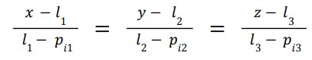
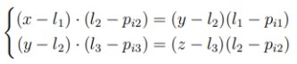
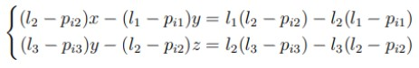
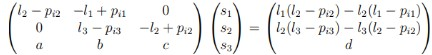
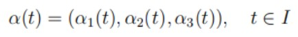
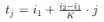
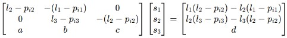
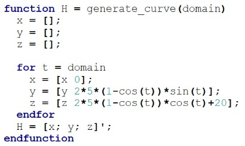
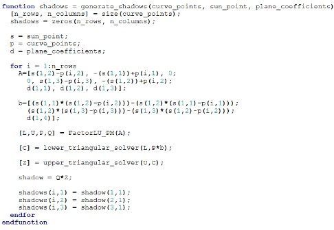
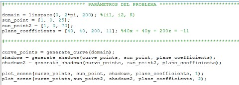

# Practica Final Algebra Lineal

## Índice
1. [Introducción](#introducción)
    1.1. [Generación de sombras como proyecciones de puntos](#generación-de-sombras-como-proyecciones-de-puntos)
    1.2. [Curvas y superficies paramétricas](#curvas-y-superficies-paramétricas)
    1.3. [Problemas propuestos](#problemas-propuestos)
    1.4. [Pregunta asignada](#pregunta-asignada) 
2. [Procesos matemáticos](#procesos-matemáticos)
3. [Solución](#solución)
4. [Conclusión](#conclusión)

## Introducción

La potencia de cálculo ha experimentado un aumento notable en las últimas dos décadas, lo que ha ampliado su aplicación en campos tan diversos como la mineríade criptomonedas y la renderización de gráficos tridimensionales con un nivel de detalle sorprendente. En el ámbito de la renderización avanzada, la última generación de videoconsolas como PlayStation 5 y Xbox Series X ha introducido conceptos revolucionarios como el ray tracing, permitiendo la recreación digital de escenas realistas que incluyen sombras, reflejos y una adaptación cromática automática.
Para comprender la generación de sombras en este contexto, este bloque se enfocará en exponer el modelo matemático basado en la geometría euclidiana tridimensional. Específicamente, se explorará la descripción de  na sombra como la proyección de un punto sobre un plano con respecto a una fuente de luz, o, de manera equivalente, como la resolución de un sistema de ecuaciones lineales.

### Generación de sombras como proyecciones de puntos

Al observar una sombra en el mundo real, ésta se ha generado debido a un emisor de fotones (sol, lámpara, etc) cuyos rayos de luz impactan sobre un objeto no translúcido, dibujando en una superficie su silueta.
Por tanto, sea L = (l1, l2, l3) ∈ un punto de luz fijo, y sea {Pi = (pi1, pi2, pi3)}k 𝑅 i=1 una
3 familia de puntos que representa un cierto objeto en el espacio. Para poder considerar el rayo de luz que va de L a cada Pi, podemos considerar la recta que une ambos puntos: si es el vector director de la recta e imponemos que pase por el punto L, en forma continua su expresión es

Esta última expresión la podemos reescribir como la intersección de dos planos como

Reordenando términos, estos dos planos pueden expresarse en su ecuación general:

Ahora, dado un plano ax + by + cz = d, la proyección del punto Pi sobre este plano respecto del punto de luz L viene dada por la solución del sistema de ecuaciones

En este caso, diremos que S = (s1, s2, s3) es el punto de sombra asociado a Pi.

### Curvas y superficies paramétricas

Para generar las sombras de objetos usando el desarrollo efectuado en la sección anterior, consideraremos curvas y superficies dadas en forma paramétrica. En el caso de una curva, dado un intervalo de definición I = [i1, i2], se define como la función vectorial 

Con el objetivo de generar una nube de puntos, se realizará una participación de I en K partes. Por lo tanto, para cada  con j ∈ {0, 1, . . . , K}, se debe evaluar α(tj ), obteniendo así una discretización de la curva. Como mayor sea K, más densidad de puntos habrá y  mayor resolución tendrá la sombra. Para una superficie, dado un rectángulo R = I × J de definición, con I = [i1, i2] y J = [j1, j2], se define como la función vectorial

.jpg)

Siguiendo la misma técnica, basta discretizar el dominio partiendo I en K partes y J en M partes, siendo .jpg) , para cada i ∈ {0, 1, . . . , K} y j ∈ {0,1,…,M}. Después, evaluando r(ui , vj), se obtiene la discretización de la superficie. Como mayor sean K y M, más densidad de puntos habrá y mayor resolución tendrá la sombra.

### Problemas propuestos

Dado un punto de luz L, los coeficientes del plano (a, b, c, d) y la expresión del objeto para proyectar, se pide:

1. Generar una nube de puntos de la curva o la superficie, siguiendo la técnica expuesta en la sección anterior. Estos puntos deben guardarse en una matriz de 3 columnas y K + filas (para curvas) o (K + 1) · (M + 1) filas (para superficies). 

2. Para cada punto de la matriz anterior, resolver el sistema de ecuaciones dado por la Expresión 6. Los puntos de sombra deben guardarse en una matriz de 3 columnas y K + 1 filas (para curvas) o (K + 1) · (M + 1) filas (para superficies). 

3. Representar el punto de luz, la curva/superficie y los puntos de sombra usando la función plot_scene proporcionada. 

**Atención**: La resolución de los sistemas de ecuaciones implicados debe hacerse mediante la factorización LU con pivotaje maximal de la matriz involucrada. 

### Pregunta asignada

Dada la cardioide α(t) = (0, 2 · 5 · (1 − cos(t)) sin(t), 2 · 5 · (1 − cos(t)) cos(t) + 20), con t ∈ [0, 2π], el plano 40x + 40y + 200z = −11, y K = 200, generar las sombras respecto los puntos de luz L1 = (1, 0, 25) y L2 = (1, 0, 70). ¿Cómo verían las sombras de L2 respecto a las de L1?

## Procesos matemáticos

Se nos propone como objetivo calcular los puntos de sombra generados por una curva parametrizada (en este caso una cardioide) proyectada sobre un plano, considerando dos puntos de luz distintos L1 y L2. Para poder resolver el problema propuesto, como hemos encontrado antes, necesitaremos resolver el siguiente sistema para todos los puntos de la cardioide mediante la factorización LU con pivotaje maximal:

Aquí (a, b, c, d) = (40, 40, 200, 11) son los coeficientes del plano y el punto de sombra asociado a Pi sería S = (s1,s2,s3). Para resolver el sistema necesitamos primero la familia de puntos de la cardioide. Si la cardioide está definida como:

α(t) = (0, 2 · 5 · (1 − cos(t)) sin(t), 2 · 5 · (1 − cos(t)) cos(t) + 20)

entonces dividimos el intervalo de t en K partes (ti) y con estos valores definimos cada punto Pi como:

Pi​ = (pi1, pi2​, pi3​) = (0, 2 ⋅ 5 ⋅ (1 − cos(ti​)) ⋅ sin(ti​), 2 ⋅ 5 ⋅ (1 − cos(ti​)) ⋅ cos(ti​) + 20)

En resumen, simplemente necesitamos calcular los K puntos de la cardioide y resolver el sistema para cada uno de ellos, de esta manera conseguimos los K puntos de sombra que se generan. Al repetir el cálculo para L2 obtenemos una segunda serie de puntos de sombra.

## Solución

Como hemos explicado en el apartado anterior, necesitamos una función que almacene en una matriz todos los puntos de la cardioide para posteriormente poder trabajar con ellos. Para ello, hemos implementado la siguiente función llamada “generate_curve”. Este código genera los  K puntos de la cardioide siguiendo la definición dada anteriormente para los K valores en el dominio de t0,2 y almacenar los resultados en la variable H:

Una vez tenemos la función “generate_curve”, necesitamos una función que resuelva el sistema propuesto anteriormente para cada punto de la cardioide. El código que cumple con esos aspectos, es el siguiente:

Como se puede comprobar en la función “generate_shadows”, primero almacenamos los datos en las variables A y b (en base a la explicación del apartado anterior), después resolvemos el sistema de ecuaciones utilizando la factorización LU con pivotaje maximal y dos funciones para resolver sistemas de ecuaciones con matrices triangulares superiores e inferiores. Finalmente almacenamos todos los resultados en la matriz ”shadows”.

Lo último que nos hace falta para poder resolver este problema es utilizar todas las funciones en un archivo main para llegar a las soluciones:

Como podemos ver en el código del main, primero de todo introducimos los parámetros del problema (dominio de la cardioide, punto de luz 1, punto de luz 2 y coeficientes del plano). Una vez tenemos los diversos parámetros, generamos la cardioide mediante la función “generate_curve” y posteriormente generamos las sombras correspondientes a cada punto de luz mediante la función “generate_shadows”. 
Por último, llamamos a la función “plot_scene”, para que nos permita generar la representación gráfica de ambas situaciones. 

## Conclusión

Como podrán apreciar al ejecutar el programa, el primer punto de luz está más cerca a la figura original, esto provoca que la sombra sea mucho más grande y esté más deformada en comparación a la figura original.
En cambio, el segundo punto de luz podrás comprobar que esta mucho mas alejado, ya que este punto de luz tiene una mayor altura, provocando que la sombra generada sea más parecida y no tenga tanta diferencia en comparación a la figura original.